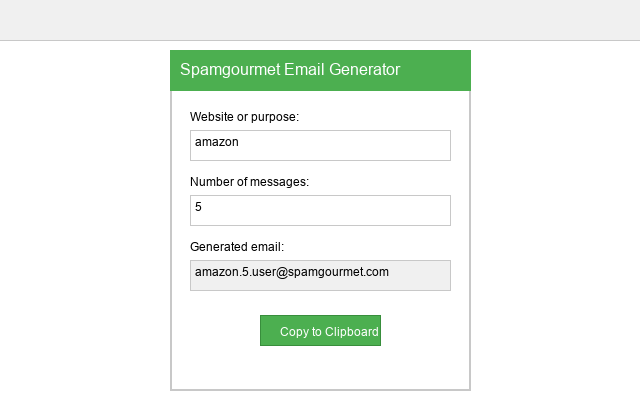
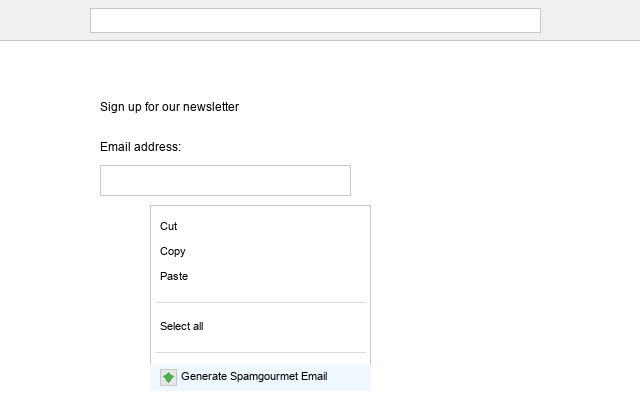

# Spamgourmet Email Generator (Unofficial)

An unofficial Chrome extension that helps protect your inbox from spam by generating disposable Spamgourmet email addresses.


## Overview

This extension allows you to quickly generate and use disposable email addresses through the [Spamgourmet](https://www.spamgourmet.com) service while browsing the web. Protect your real email address from spam, track which websites sell your data, and keep your inbox clean.

**IMPORTANT: This is an unofficial extension and is not affiliated with, endorsed by, or connected to Spamgourmet in any way.**

## Features

- Generate disposable Spamgourmet email addresses with just a few clicks
- Customize the number of messages each address will accept
- Right-click on any email field to generate and insert addresses
- View your history of generated addresses
- Integrates seamlessly with the Spamgourmet service

## Screenshots

### Main Popup Interface


### Context Menu Integration


## Installation

### From Chrome Web Store
Search for "Spamgourmet Email Generator (Unofficial)" in the Chrome Web Store or [click here](#) (link will be added once published).

### Manual Installation (for developers)
1. Clone this repository
2. Open Chrome and go to `chrome://extensions/`
3. Enable "Developer mode" (toggle in the top right)
4. Click "Load unpacked" and select the repository folder
5. The extension should now be installed and visible in your toolbar

## Usage

1. Click the extension icon in your toolbar
2. Enter the website name or purpose for the email address
3. Select how many messages the address should accept
4. Copy the generated address or use it directly via the context menu
5. Receive forwarded messages to your real inbox until the limit is reached

## Requirements

- Chrome browser (version 88 or later)
- A Spamgourmet account (free to create at [spamgourmet.com](https://www.spamgourmet.com))

## Privacy

This extension:
- Does not collect any personal data or browsing history
- Stores your Spamgourmet username and generated addresses locally on your device
- Only communicates with Spamgourmet to generate valid email addresses
- Does not use any tracking technologies or analytics

See the [Privacy Policy](privacy_policy.md) for more details.

## Development

This project was created to provide a modern, user-friendly interface for the Spamgourmet service. The extension is built using standard web technologies:

- HTML/CSS for the popup interface
- JavaScript for extension functionality
- Chrome Extension Manifest V3

### Project Structure
```
├── background.js       # Service worker for background tasks
├── content.js          # Content script for page interaction
├── icons/              # Original icon source files
├── images/             # Extension icons in various sizes
├── popup.html          # Main extension popup interface
├── manifest.json       # Extension configuration
└── screenshots/        # Screenshots for documentation
```

### Build and Package
To package the extension for distribution:

```
python package_extension.py
```

## Contributing

Contributions are welcome! Please feel free to submit a Pull Request to the [GitHub repository](https://github.com/HairyDuck/spamgourmet-extension-unofficial).

## License

MIT License - see the [LICENSE](LICENSE) file for details.

## Disclaimer

This extension is a community-created project and is not officially associated with Spamgourmet. The developers of this extension are not affiliated with Spamgourmet and do not have any official relationship with the service. This extension simply provides a convenient interface for using the publicly available Spamgourmet service. 